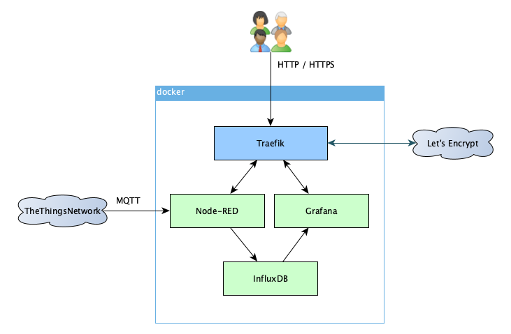

# TTN Dashboard
<!-- markdownlint-disable MD025 -->

# Contents

<!-- markdownlint-disable MD007 -->
<!-- TOC updateonsave:false depthto:3 -->

- [Introduction](#introduction)
- [Requirements](#requirements)
    - [Linux host](#linux-host)
    - [Domain names](#domain-names)
- [Installation](#installation)
    - [Initial setup](#initial-setup)
    - [Managing Containers](#managing-containers)
    - [Adding Secure HTTP HTTPS](#adding-secure-http-https)
- [Data persistence](#data-persistence)
- [Configuring the dashboard](#configuring-the-dashboard)
    - [Node-RED](#node-red)
        - [Getting data from The Things Network](#getting-data-from-the-things-network)
        - [Storing data in InfluxDB](#storing-data-in-influxdb)
    - [Grafana](#grafana)
- [Advanced Configuration](#advanced-configuration)
    - [Additional parameters](#additional-parameters)
    - [Monitoring your servers with collectd](#monitoring-your-servers-with-collectd)
        - [Monitoring the TTN Dashboard host](#monitoring-the-ttn-dashboard-host)
        - [Monitoring additional hosts](#monitoring-additional-hosts)

<!-- /TOC -->

# Introduction

_TTN Dashboard_ provides an easy to setup environment for displaying [The Things Network](https://www.thethingsnetwork.org/) application data on a [Grafana](https://grafana.com/) dashboard.

This setup is based on Containers orchestrated by [docker-compose](https://docs.docker.com/compose/).\
It does not require a lot of resources and can run on a small Linux cloud instance or an ARM based device like a [Raspberry Pi](https://www.raspberrypi.org/).

This project uses [Traefik](https://doc.traefik.io/traefik/) as Edge Router.  
Previous version was using [NGINX](https://www.nginx.com/) as reverse proxy, this is still available in the `nginx` branch of this repository, but it isn't maintained anymore.

The project uses the following container images:

- [Traefik](https://doc.traefik.io/traefik/) as Edge Router (only needed if you do not already run a Traefik instance on your host)
- [Node-RED](https://nodered.org/): user friendly interface to collect data from [The Things Network](https://www.thethingsnetwork.org/), process it and store it into a database
- [InfluxDB](https://www.influxdata.com/): Time series database to store the data
- [Grafana](https://grafana.com/): provides web-based dashboards from the stored data



# Requirements

## Linux host

You will need a Linux host with a container runtime (`docker` or `podman`), `docker-compose` and `git` installed.  
Minimum required versions are:

- `docker`: 17.06.0 or above
- `podman`: 3.0 or above
- `docker-compose`: 1.18.0 or above

However, for security reason, latest versions are strongly recommended.

## Domain names

If you want to expose your dashboard to the Internet, you will need domain names!  
Traefik uses the domain name to route the requests to either Grafana or Node-RED; you will need two domain names pointing to your server -- e.g.: `ttn-grafana.example.com` and `ttn-node.example.com`.  
If you don't have your own domain you can use a free service like [Duck DNS](https://www.duckdns.org).

For local/home usage (intranet) you can use a local DNS server or even the _hosts_ file of your workstation.

# Installation

## Initial setup

1. Clone this repository and enter its directory:

   ```shell
   git clone https://github.com/oracle/AmedeeBulle/ttn-dashboard.git
   cd ttn-dashboard
   ```

1. Copy the `.env.distr` file to `.env`

   ```shell
   cp .env.distr .env
   ```

1. Customize the `.env` file to your needs, the following parameters are mandatory:
   - Host names
     - `TTN_GRAFANA_HOST`: the hostname to access the Grafana dashboard -- e.g.: `ttn-grafana.example.com`
     - `TTN_NODE_RED_HOST`: the hostname to access the Node-RED interface -- e.g.: `ttn-node.example.com`
   - InfluxDB
     - `TTN_INFLUX_ADMIN_PASSWORD`: administration password
     - `TTN_INFLUX_PASSWORD`: password for the user with read/write access (used in Node-RED to insert data)
     - `TTN_INFLUX_READ_PASSWORD`: password for the user with read-only access (used in Grafana to query the database)
   - Grafana
     - `TTN_GRAFANA_ADMIN_PASSWORD`: password for the admin user (additional users are defined in Grafana itself)
   - Node-RED
     - `TTN_NODE_RED_CREDENTIALS`: credentials to access the Node-RED instance.
   - Traefik
     - If you already run a Traefik container instance, set the network name, Entry Points and Certificate Resolver to match your existing configuration.
     - Otherwise set `TRAEFIK_EMAIL`, the email address used when requesting Let's Encrypt certificates.
1. Building container images.  
   The `node-red` container needs to be built to add the `influxdb` nodes:

   ```shell
   docker-compose build
   ```

   docker network create traefik
1. If you don't already run a Traefik container instance, add `docker-compose-traefik.yml` to the stack and create the `traefik` overlay network:

   ```shell
   export COMPOSE_FILE=docker-compose.yml:docker-compose-traefik.yml
   docker network create traefik
   ```

1. Start the containers (use _Control-C_ to stop):

   ```shell
   docker-compose up
   ```

The InfluxDB database will be created and initialized the first time the container runs.

You should be able to browse to your new Node-RED/Grafana setup using the specified domain names.

## Managing Containers

Basic `docker-compose` commands.

Start the containers (in _detached_ mode):

```shell
docker-compose up -d
```

View the log (use `-f` to follow log output):

```shell
docker-compose logs [-f]
```

Stop (kill) the containers:

```shell
docker-compose kill
```

Stop and destroy the containers:

```shell
docker-compose down
```

## Adding Secure HTTP (HTTPS)

If you expose your setup to the Internet you should enable `HTTPS` to encrypt the traffic.

This will happen automatically once you add `docker-compose-https.yml` to the compose stack:

1. Stop the containers (if they already run)

   ```shell
   docker-compose down
   ```

1. Set the `COMPOSE_FILE` environment variable:

   ```shell
   # If you have a separate traefik container:
   export COMPOSE_FILE=docker-compose.yml:docker-compose-https.yml
   # Or with the traefik container from this repository
   export COMPOSE_FILE=docker-compose.yml:docker-compose-traefik.yml:docker-compose-https.yml
   ```

1. Restart the compose stack:

   ```shell
   docker-compose up -d && docker-compose logs -f
   ```

It might take a couple of minutes to get the Let's Encrypt signed certificates in place, after which you can enjoy Secure HTTP!

Note that the HTTPS configuration is only possible if your server is exposed to the Internet (either directly or through NAT) as Let's Encrypt needs to authenticate the service (strictly speaking, Traefik also supports Let's Encrypt `DNS-01` challenge, but you will have to update the Traefik configuration in `docker-compose-traefik.yml`)

# Data persistence

Data (database, certificates, ...) is stored in docker named volumes and persists across container/system restart.

If you really want/need to delete the volumes and the associated data, run:

```shell
docker-compose down --volumes
```

# Configuring the dashboard

This section covers the settings specific to this project; detailed instructions on how to use Node-RED and Grafana is outside the scope of this document.

## Node-RED

### Getting data from The Things Network

See [The Things Stack Node-RED Integration](https://www.thethingsindustries.com/docs/integrations/node-red/).

### Storing data in InfluxDB

Configuration of the InfluxDB _Server_ in the InfluxDB nodes:

- `Host`: influxdb
- `Port`: 8086
- `Database`: same as `TTN_INFLUX_DB` parameter (default: ttn)
- `Username`: same as `TTN_INFLUX_USER` parameter (default: ttn-user)
- `Password`: same as `TTN_INFLUX_PASSWORD` parameter
- `Enable secure (SSL/TLS) connection`: unchecked

## Grafana

Create an InfluxDB data source (leave all fields not mentioned here to their default value):

- `URL`: `http://influxdb:8086`
- `Database`: same as `TTN_INFLUX_DB` parameter (default: ttn)
- `User`: same as `TTN_INFLUX_READ_USER` parameter (default: ttn-read)
- `Password`: same as `TTN_INFLUX_READ_PASSWORD` parameter

# Advanced Configuration

## Additional parameters

The setup can be further customised (usernames, log level, ...) in the `.env`. It should be self-explanatory.

## Monitoring your servers with collectd

You can monitor your servers with [collectd](https://collectd.org/), and send the data to your InfluxDB instance

### Monitoring the TTN Dashboard host

If you only want to monitor the dashboard host, perform the following easy steps:

1. Install collectd using your operating system package manager (`yum`, `apt`, ...)
1. On the collectd side, ensure the `network` plugin is enabled and configured -- E.g. in `/etc/collectd.conf`:

   ```text
   ...
   LoadPlugin network
   ...
   <Plugin network>
     # client setup:
     <Server "127.0.0.1" "25826">
       SecurityLevel None
     </Server>
   ...
   </Plugin>
   ...
   ```

1. Configure InfluxDB in the `.env` configuration file:

   ```text
   # Monitoring servers with collectd:
   TTN_INFLUXDB_COLLECTD_ENABLED=true
   # Database name for collectd (by default use the initial DB)
   TTN_INFLUX_COLLECTD_DB=ttn
   # Port to bind on: do NOT bind on your public interface!
   TTN_INFLUXDB_BIND_ADDRESS=127.0.0.1:25826
   # Security level (none, sign, encrypt)
   TTN_INFLUXDB_COLLECTD_SECURITY_LEVEL=none
   ```

1. Re-start collectd and the containers

### Monitoring additional hosts

If you want to monitor additional hosts (e.g. your gateways, ...), you will have to use the (private) IP of your server instead of the loopback interface.\
It is also recommended to encrypt the collectd traffic.

1. Install collectd using your operating system package manager (`yum`, `apt`, ...)
1. On the collectd side, ensure the `network` plugin is enabled and configured -- E.g. in `/etc/collectd.conf`:

   ```text
   ...
   LoadPlugin network
   ...
   <Plugin network>
     # client setup:
     <Server "<YourServerPrivateIP>" "25826">
       SecurityLevel Encrypt
       Username "<YourCollectdUser>"
       Password "<YourSecretPassword>"
     </Server>
   ...
   </Plugin>
   ...
   ```

1. Configure InfluxDB in the `.env` configuration file:

   ```text
   # Monitoring servers with collectd:
   TTN_INFLUXDB_COLLECTD_ENABLED=true
   # Database name for collectd (by default use the initial DB)
   TTN_INFLUX_COLLECTD_DB=ttn
   # Port to bind on: do NOT bind on your public interface!
   TTN_INFLUXDB_BIND_ADDRESS=<YourServerPrivateIP>:25826
   # Security level (none, sign, encrypt)
   TTN_INFLUXDB_COLLECTD_SECURITY_LEVEL=encrypt
   ```

1. Create a file named `auth_file` with the username/password pair you specified in the `/etc/collectd.conf` file:

   ```text
   <YourCollectdUser>:<YourSecretPassword>
   ```

1. Copy that file into the `ttn_influxdb` volume

   ```text
   $ # the actual volume name may vary depending on your configuration
   $ docker volume ls | grep ttn_influxdb
   local               ttn-dashboard_ttn_influxdb
   $ # copy the file to the volume
   $ docker cp auth_file ttn-dashboard_ttn_influxdb:/etc/collectd/
   ```

1. Re-start collectd and the containers
